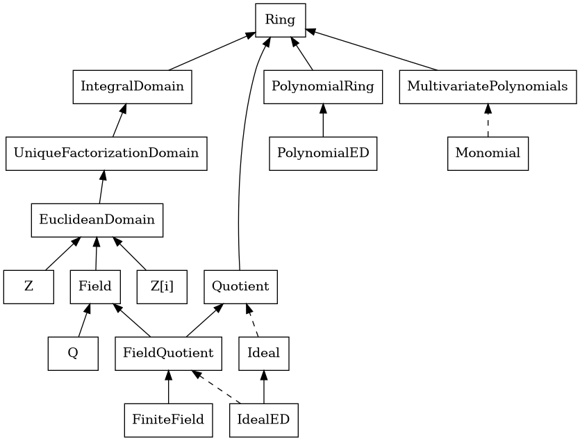

# Contributing

## Structures and Elements

Structures, such as `Z` or `Z[X]`, are instances of one of the classes in the abstract hierarchy. Some have their own classes, like `Z` which has its own class also called `Z`, while others have more general classes to allow flexible construction of new structures, like `Z[X]`, which is a `PolynomialRing`.

Each class in the abstract hierachy has an inner `Element` class. This class defines the operations allowed in the structure, and all new structures that wish to add more operations must provide an inner `Element` class which inherits from the `Element` of the parent structure. For example, `Z` inherits from `EuclideanDomain`, so `Z.Element` inherits from `EuclideanDomain.Element`.

## Abstract hierarchy

## Programming conventions

When you override functions such as `__init__` or operators in a subclass, make sure to call `super()` adequately. See [this guide](https://rhettinger.wordpress.com/2011/05/26/super-considered-super/). This allows, for example, to do type checking for the `__add__` operator inside `Ring.__add__`, instead of having to write type checking code in each subclass.

Whenever a structure is created, the `Element` class is decorated with a `ring` field before calling `__init__`, so that `<tructure>.Element.ring` = `<structure>`. This provides a means to test whether two elements belong to the same structure, by testing `elem1.ring == elem2.ring`.

